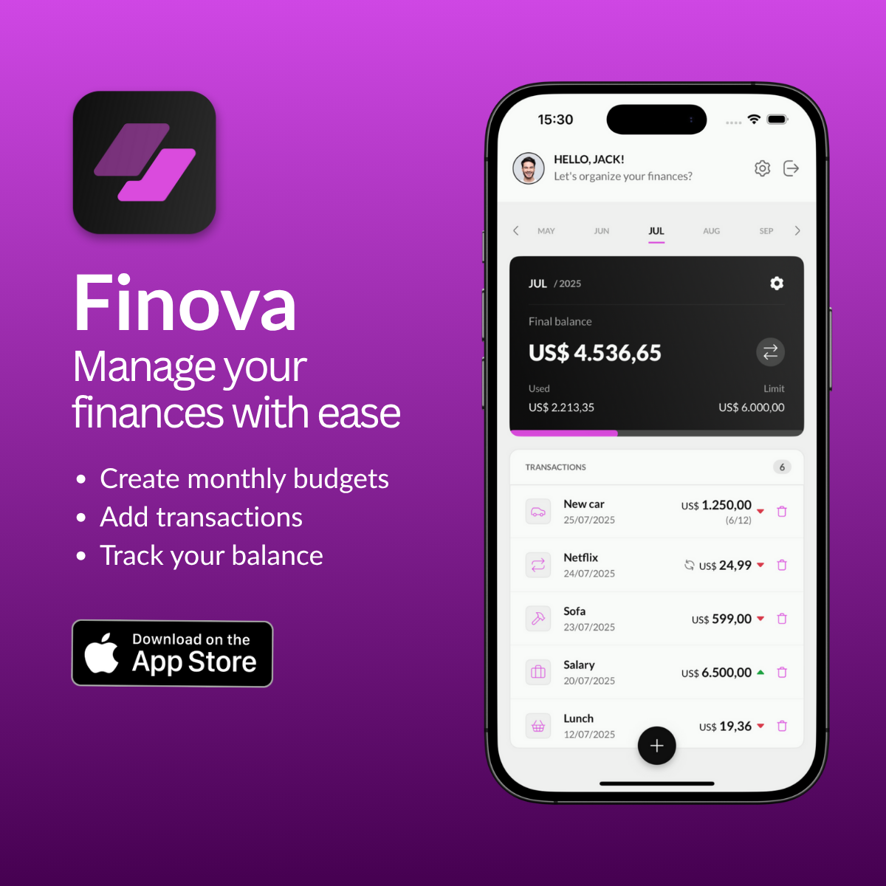
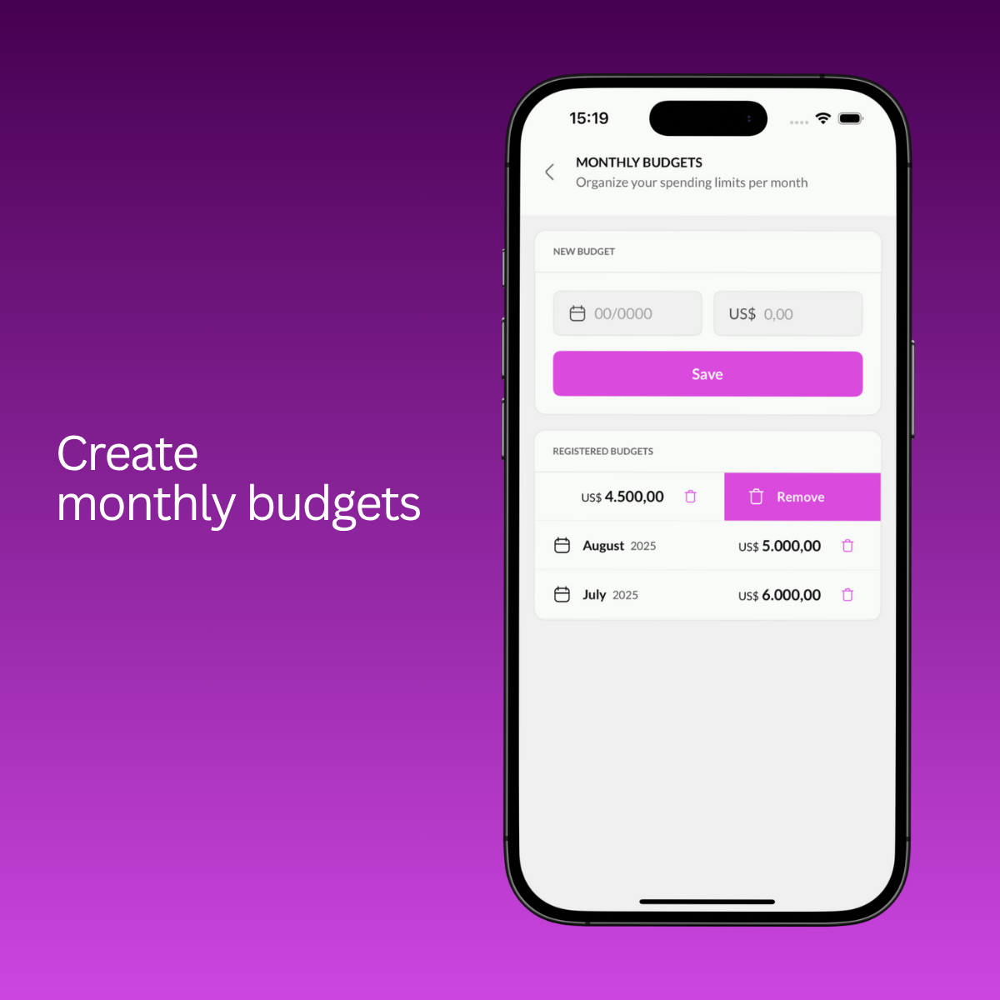
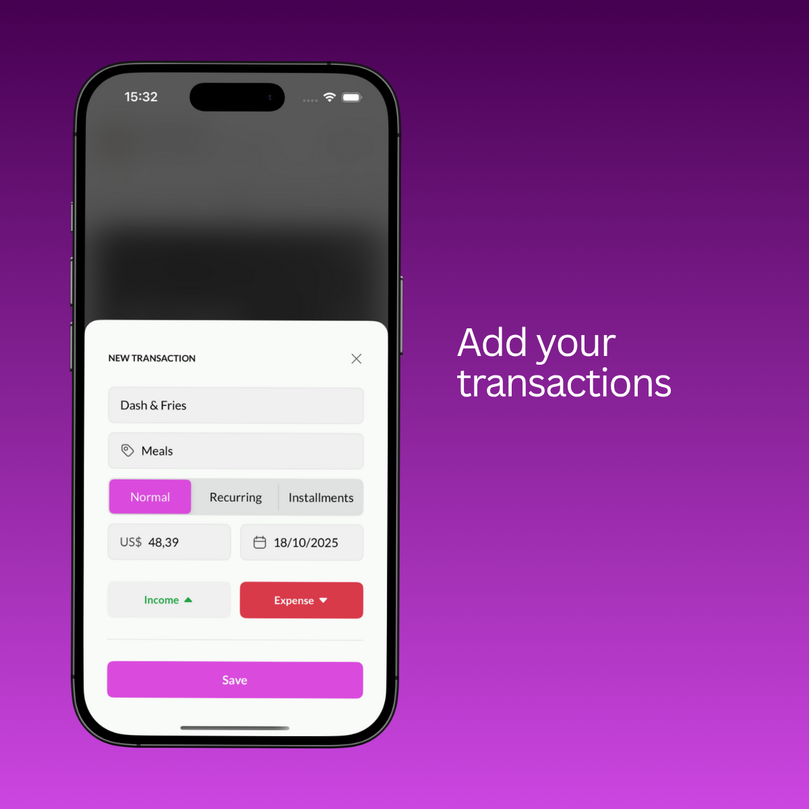
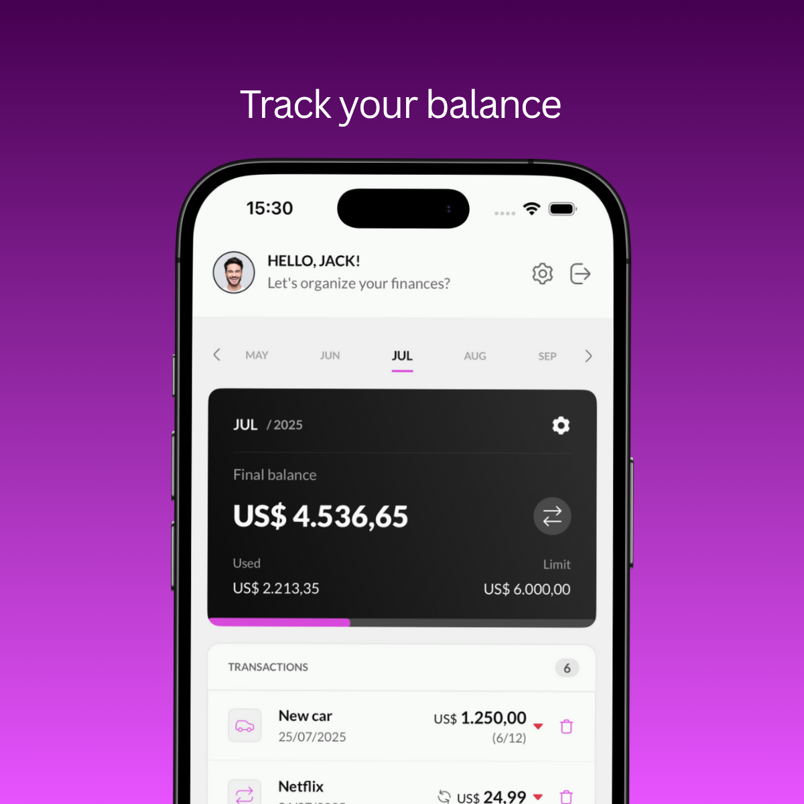
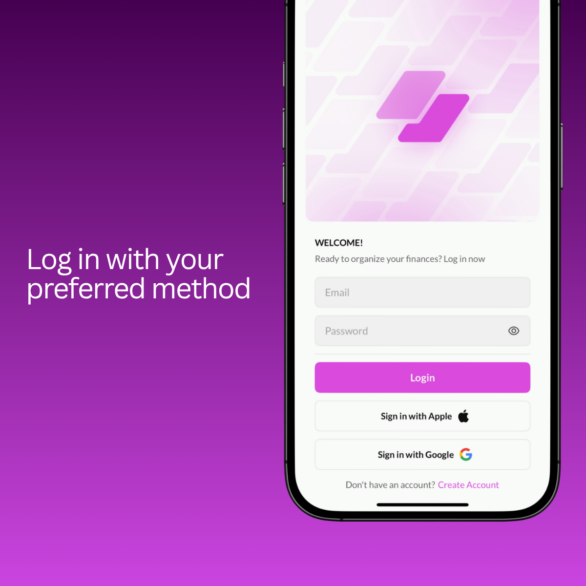

# 📱 Finova - Personal Finance Manager

A comprehensive personal finance management app built with Swift and UIKit, featuring secure local data storage, multiple authentication methods, and modern development practices.

## 🚀 App Showcase


*Finova - Manage your finances with ease. Available on the App Store with features for creating monthly budgets, adding transactions, and tracking your balance.*

## 🎯 Portfolio Highlights

### **Technical Excellence**
- **Complex Authentication System**: Firebase Authentication with Google Sign-In, Apple Sign-In, and biometric authentication
- **Advanced Data Architecture**: SQLite with CryptoKit encryption and secure local storage
- **Modern iOS Development**: Swift 5.0+, UIKit with programmatic UI, MVVM architecture
- **Robust CI/CD Pipeline**: GitHub Actions + Xcode Cloud with automated testing and deployment
- **Security-First Design**: Privacy-first architecture with zero cloud data storage

### **Key Features Implemented**
- **Recurring & Installment Transactions**: Automated transaction management with smart scheduling
- **Real-time Budget Tracking**: Monthly budgets with visual progress indicators
- **Multi-device Support**: Biometric account linking for seamless cross-device experience
- **Smart Notifications**: Transaction reminders and budget alerts
- **Responsive UI/UX**: Shimmer effects, smooth animations, and modern design patterns

## ⚠️ Important Notes

### **Repository Purpose**
- This is a **portfolio project** - not open for contributions
- **No sensitive data** is stored in this repository
- All API keys and secrets are managed through GitHub Secrets
- **Demo purposes only** - actual app uses production credentials

### **Privacy & Security**
- **No production credentials** are included in this codebase
- **Firebase configuration** uses demo/test credentials
- **All sensitive data** is managed through secure CI/CD pipelines
- **Local data encryption** ensures user privacy protection

## 🚀 Quick Start

```bash
# Clone the repository
git clone <your-repo-url>
cd swift-finance-app

# Setup development environment
./scripts/setup.sh

# Open in Xcode
open FinanceApp.xcworkspace
```

## 🏗️ Project Status

- **Current Version**: 1.0.3 (Active Development)
- **iOS Deployment**: iOS 16.6+
- **Xcode**: 16.2.0+
- **Swift**: 5.0+

## 📋 Features

### 🔐 **Authentication & Security**
- **Multiple Sign-In Options**: Firebase Authentication with Google Sign-In and Apple Sign-In
- **Biometric Authentication**: Face ID/Touch ID support for secure app access
- **Account Data Linking**: Smart biometric account linking for multi-device support
- **Secure Local Storage**: All financial data encrypted and stored locally

### 💰 **Transaction Management**
- **Smart Categorization**: 20+ transaction categories with Lucide icons
- **Recurring Transactions**: Automated recurring transaction generation and management
- **Installment Tracking**: Support for installment-based transactions (e.g., loans, payments)
- **Transaction Modes**: Normal, Recurring, and Installment transaction types

### 📊 **Budget & Financial Tracking**
- **Monthly Budgets**: Set and track monthly spending limits
- **Real-time Balance**: Current vs. final balance tracking
- **Expense Monitoring**: Visual progress bars and spending alerts
- **3-Year History**: Comprehensive financial data spanning 36 months

### 🎨 **Modern UI/UX**
- **Shimmer Effects**: Beautiful loading animations throughout the app
- **Smooth Animations**: Custom transitions and micro-interactions
- **Responsive Design**: Optimized for all iPhone screen sizes
- **Dark Mode Ready**: Light theme with dark mode preparation

### 📱 **Dashboard & Analytics**
- **Monthly Carousel**: Swipe through months with smooth transitions
- **Financial Overview**: Income, expenses, and balance at a glance
- **Transaction History**: Detailed transaction list with search and filtering
- **Smart Notifications**: Transaction reminders and budget alerts

## 🖼️ App Screenshots

### Budget Management

*Create and manage monthly budgets with easy-to-use interface for setting spending limits*

### Add Transaction Modal

*Add new transactions with smart categorization, recurring options, and installment support*

### Balance Tracking

*Detailed view of monthly balance tracking with progress indicators and transaction history*

### Authentication & Login

*Secure authentication with multiple sign-in options including Apple Sign-In and Google Sign-In*

## 🛠️ Tech Stack

- **Language**: Swift 5.0+
- **UI Framework**: UIKit with programmatic UI
- **Architecture**: MVC with Flow Coordinator Pattern
- **Database**: SQLite with secure local encryption
- **Authentication**: Firebase Authentication (Google + Apple Sign-In)
- **Security**: CryptoKit encryption, Keychain Services, Biometric Authentication
- **UI Enhancements**: Custom animations, shimmer effects, responsive layouts
- **Dependency Management**: CocoaPods
- **CI/CD**: GitHub Actions + Xcode Cloud
- **Code Quality**: SwiftLint
- **Testing**: XCTest with iPhone 16 simulator

## 🔄 Development Workflow

### 1. Local Development
```bash
# Create feature branch from develop
git checkout -b feature/expense-tracking

# Make changes with conventional commits
git commit -m "feat(tracking): add expense categorization"

# Push and create PR
git push origin feature/expense-tracking
```

### 2. Commit Convention
```bash
# Features
feat(scope): description

# Bug fixes
fix(scope): description

# Breaking changes
feat(scope)!: description
```

## 🧪 Testing

```bash
# Run unit tests (using iPhone 16 simulator)
xcodebuild test -workspace FinanceApp.xcworkspace -scheme FinanceApp -destination 'platform=iOS Simulator,name=iPhone 16,OS=latest'

# Run SwiftLint
swiftlint

# Fix SwiftLint issues automatically
swiftlint autocorrect
```

## 🏗️ Architecture

```
FinanceApp/
├── Sources/
│   ├── Core/              # Core functionality and utilities
│   │   ├── Components/    # Reusable UI components
│   │   ├── Database/      # SQLite and secure data management
│   │   ├── Models/        # Data models and entities
│   │   ├── Repositories/  # Data access layer
│   │   └── Utils/         # Utility classes and extensions
│   └── Scenes/            # UI scenes and view controllers
├── Resources/             # Assets, fonts, and configuration files
├── FinanceAppTests/       # Unit and integration tests
├── .github/workflows/     # CI/CD pipeline definitions
├── scripts/               # Build and setup scripts
└── docs/                  # Project documentation
```

## 🔐 Security & Privacy

- 🔒 **Firebase Authentication** for secure user login
- 🍎 **Apple Sign-In** for privacy-focused authentication
- 💾 **All financial data stored locally** in encrypted SQLite database
- 🔐 **No sensitive financial data sent to cloud servers**
- 🛡️ **Automated security scanning** in CI pipeline
- 📱 **Privacy-first architecture** design
- 🔑 **Biometric authentication** with Face ID/Touch ID

## 📊 CI/CD Pipeline

- ✅ Automated testing on pull requests
- 🔍 Code quality checks with SwiftLint
- 🔒 Security vulnerability scanning with Trivy
- 📦 Semantic versioning for releases
- 📈 Build artifacts and test reports
- 🚀 Hybrid approach: GitHub Actions + Xcode Cloud

## 🆘 Support

### Getting Help
- 📖 Check the documentation in the `docs/` folder
- 🐛 Open an issue for bugs or feature requests
- 💬 Review the development workflow guide

### Common Issues
- **Build failures**: Ensure Xcode 16.2.0+ and run `pod install`
- **SwiftLint errors**: Run `swiftlint autocorrect` for auto-fixes
- **CocoaPods issues**: Try `pod install --repo-update`
- **Simulator issues**: Use iPhone 16 simulator for testing
- **Authentication issues**: Check Firebase configuration and Apple Sign-In setup

## 📄 License & Usage

This project is licensed under the MIT License.

**Important**: This repository is for portfolio and demonstration purposes only. The actual Finova app uses different credentials and configurations not included here. No production data or sensitive information is stored in this codebase.

## 🙏 Acknowledgments

- Firebase team for authentication services
- SQLite.swift contributors for database integration
- iOS development community for best practices
- Open source contributors for inspiration
- Lucide team for beautiful icons

---

**Status**: Active Development  
**Last Updated**: July 2025 